# Keycloak

## Setup on localhost
Run command `docker-compose -f .\docker-compose\keycloak.yml up -d`

## Setup on kubernetes
Run command `kubectl -f .\kubernetes\keycloak.yml`

## Login Keycloak
If you are localhost, open url: http://localhost:8081/

Username: admin

Passwrod: P@ssw0rd 

## Create new Realm
Click dropdown Master and click button `Add realm`
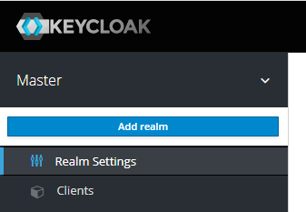

Enter realm name and click `Create`
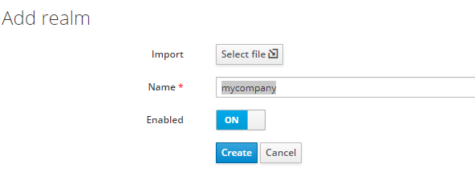

## Add roles
Open menu Roles and click button `Add Role`
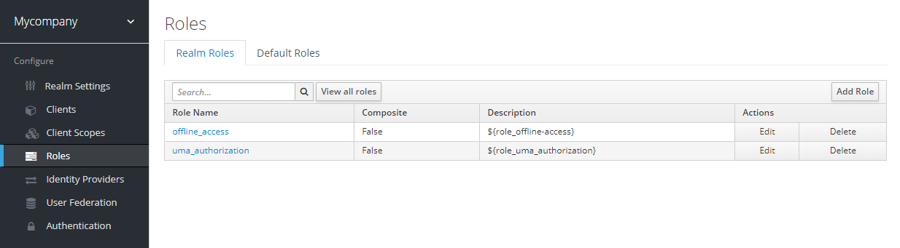

Type `Claims` into Role Name then save
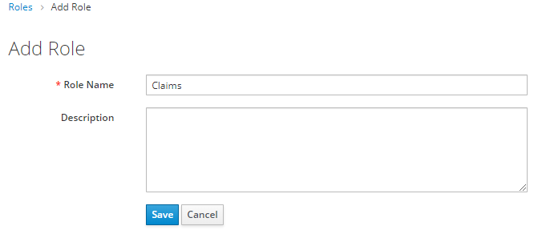

Do the previous step to add role `Underwriting`

## Setup client
Open menu Clients and select client `account`
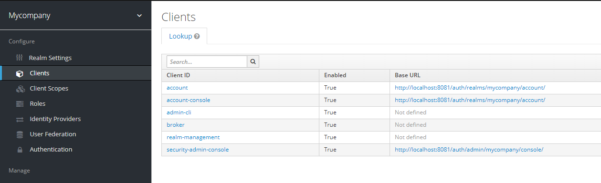

Enable Direct Access Grants and type `*` into Web Origins 
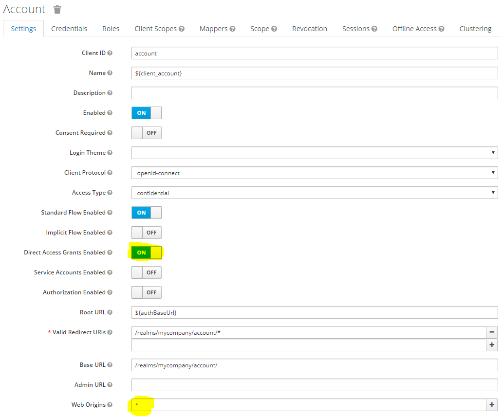

Open tab `Credentials` and copy secrect value
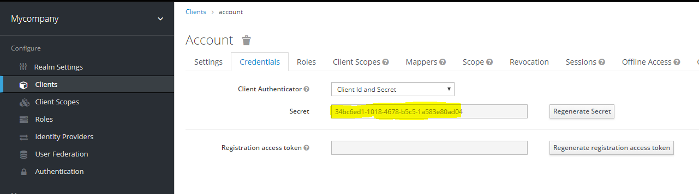

Open tab `Scope` and select Realm Roles `Claims` and `Underwriting` and click button `Add selected`
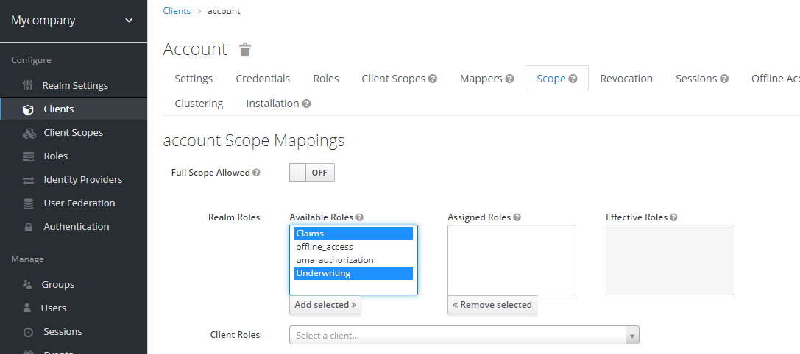

## Add group
Open menu `Groups` and click button `New` then type `Claim Group`
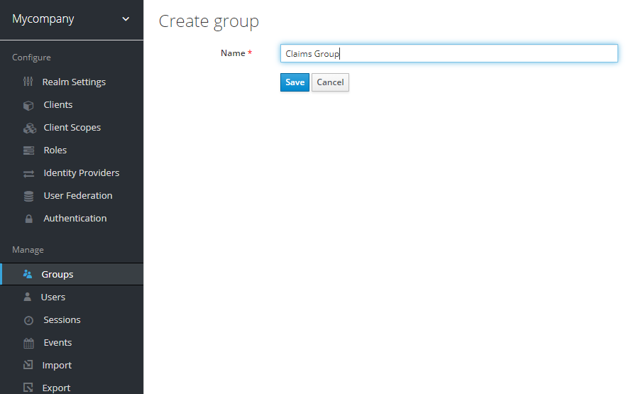

Open tab `Role Mappings` and add Realm Role `Claims`
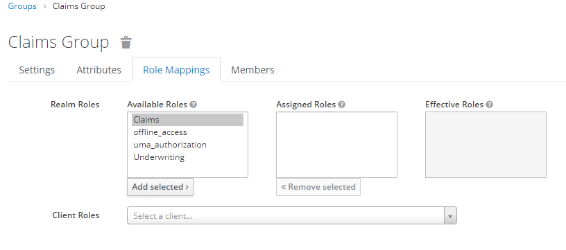

Do the previous steps to add role `Underwriting Group`

## Add user
Open menu `Users` and click button `Add user`
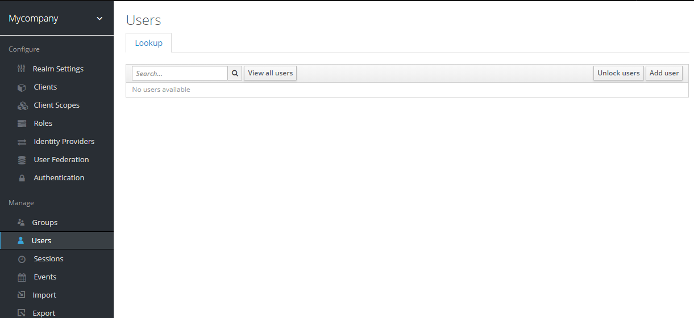

Type `usera` into Username then click button `Save`
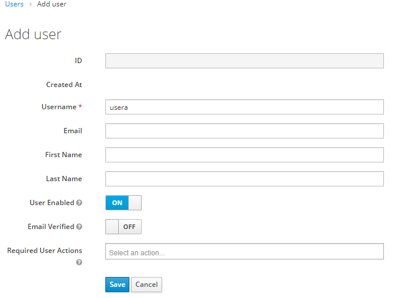

Open tap `Groups` and join 2 groups `Claims group` and `Underwriting Group`
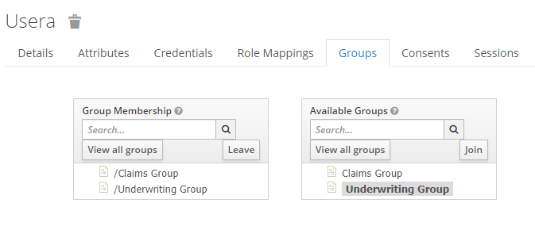

Open tap `Credentials` and set password, set Temporary `Off`
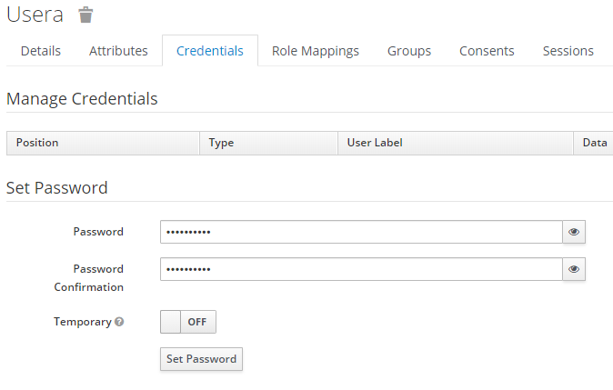


Do the previous steps to add user `userb` and join group `Claims Group`

## Authentication endpoints
Login Url: http://localhost:8081/auth/realms/mycompany/protocol/openid-connect/token

Authority: http://localhost:8081/auth/realms/mycompany

Audience: `account`

Client Id: `account`

Client Secret: the value you copied in `Clients -> account -> Credentials`

## Form login
POST http://localhost:8081/auth/realms/mycompany/protocol/openid-connect/token

Headers:
`Content-Type: application/x-www-form-urlencoded`

Form Data
```
username: userb
password: the password
grant_type: password
client_secret: the client secret
client_id: account
```

## Jwt 
This is a sample of Jwt after logging in
```
{
  "exp": 1585110293,
  "iat": 1585109993,
  "jti": "e44ccd9b-f2d3-4d92-95c3-6c3df2728adb",
  "iss": "http://localhost:8081/auth/realms/mycompany",
  "sub": "2c239e89-1ef8-4649-9d65-110c46a4170b",
  "typ": "Bearer",
  "azp": "account",
  "session_state": "662e6155-32a6-4cb6-a8dc-21be5d039689",
  "acr": "1",
  "allowed-origins": [
    "*"
  ],
  "realm_access": {
    "roles": [
      "Claims"
    ]
  },
  "resource_access": {
    "account": {
      "roles": [
        "manage-account",
        "manage-account-links",
        "view-profile"
      ]
    }
  },
  "scope": "email profile",
  "email_verified": false,
  "preferred_username": "userb"
}
```
User roles is `realm_access.roles`